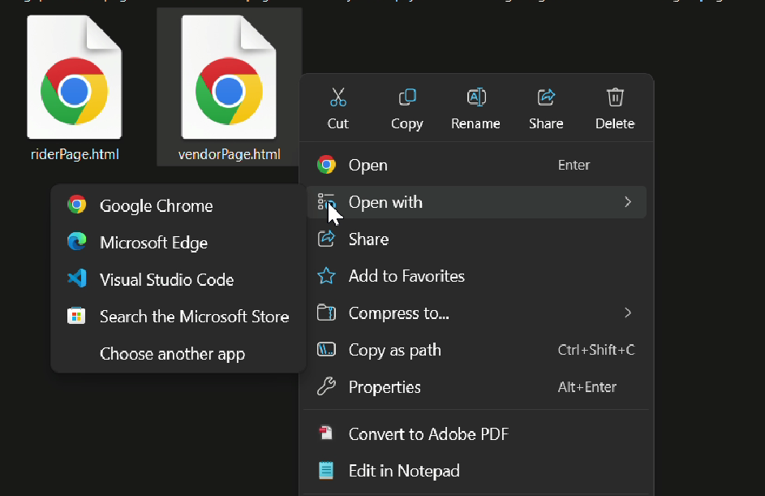

## EasyFoodUUM.my User Testing (**_NOTE : Please use your PC/Laptop only._**)

## 🚀 PROJECT OVERVIEW

**EasyFoodUUM.my is a ongoing website project focused on expanding and promoting food and beverages business inside and around Universiti Utara Malaysia (UUM) campus area**

**We would like to recieve feedbacks for the project! : [Feedback/Review Here](https://forms.gle/v9HhhYUnjtKtmMbR7)**

It consist of **3 type of users** :

**1. Food delivery rider** :

* Students are open for registration to be food delivery rider as source of pocket money.
* Riders can keep track oncoming orders and delivery address using embed Google Maps 

**2. Food Vendor** :

* Registered food vendors can customize and edit food menu and prices accordingly. (Upcoming)
* Vendors can keep track oncoming orders and customer location to synchronize with riders location (using Embed Google Maps)

**3. Customers** :

* Customers can login using multiple accounts (Google,UUM email,etc)
* Customers(anyone) are able to orders food with supported payment methods.
* Customers can set orders pickup location

## 👣 HOW TO TEST OUR PROJECT ?

1. **Download and unzip the files : [Files (zipped,please extract.)](https://files.catbox.moe/k449fa.zip)**

2. **Double-click on `login_page.html` and other files with *.html* type.**

3. **If Confused, open file with 'Google Chrome' or 'Microsoft Edge'**

4. **Start exploring our project !**

## ❓REVIEW/FEEDBACK 

5. **Answer our Feedback/Review form!! : [Review/Feedback Here](https://forms.gle/v9HhhYUnjtKtmMbR7)**

THANKS FOR YOUR ATTENTION !!
