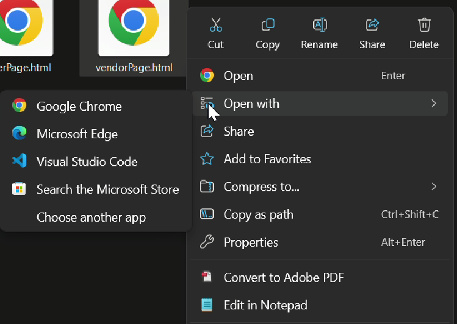

## EasyFoodUUM.my 

**EasyFoodUUM.my is a website focused on expanding and promoting food and beverages business inside and around Universiti Utara Malaysia(UUM) campus area**

It consist of **3 type of users** :

**1. Food delivery rider** :

* Students are open for registration to be food delivery rider as source of pocket money.
* Riders can keep track oncoming orders and delivery address using embed Google Maps 

**2. Food Vendor** :

* Registered food vendors can customize and edit food menu and prices accordingly. (Upcoming)
* Vendors can keep track oncoming orders and customer location to synchronize with riders location (using Embed Google Maps)

**3. Customers** :

* Customers can login using multiple accounts (Google,UUM email,etc)
* Customers(anyone) are able to orders food with supported payment methods.
* Customers can set orders pickup location

## 👣 How to Start ?

1. **Download and unzip the files**
**_https://files.catbox.moe/0gl5mo.zip_**
2. **Double-click on `start-here.html` and other files with *.html* type.**
3. **If Confused, open file with 'Google Chrome' or 'Microsoft Edge'**

4. **Start exploring our project !**

Disclaimer : This is a prototype which is a result from our idea implementation, please leave any feedback from this Google Forms provided:

**https://forms.gle/v9HhhYUnjtKtmMbR7**

Thanks!
